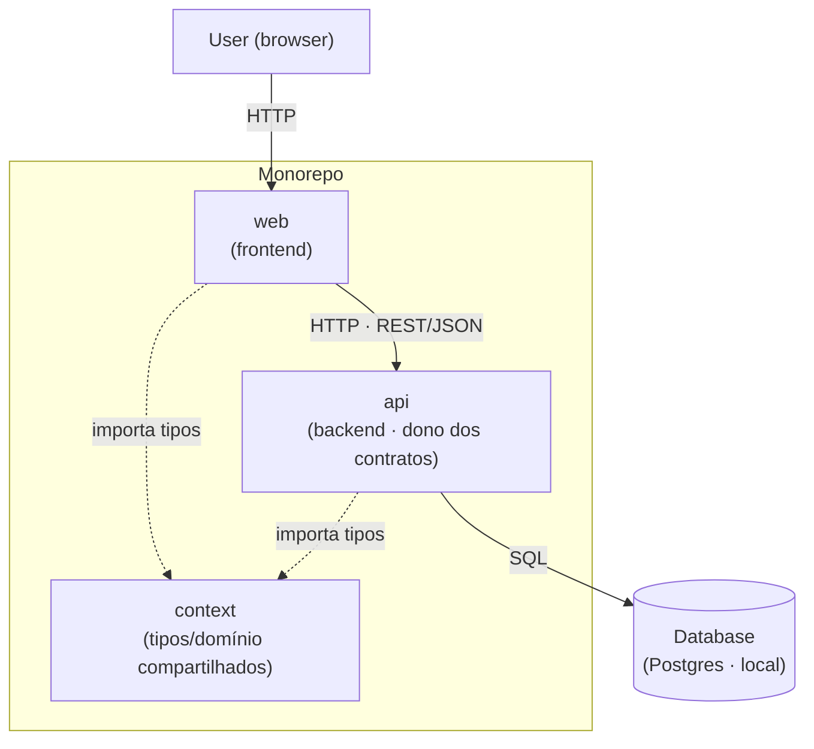

# Visão de arquitetura (C4 — contexto + containers)

> **Documento vivo.** Retrata a topologia **vigente** do monorepo: quais partes existem e
> como se conectam. Atualize na **mesma edição** que adiciona/remove uma parte ou
> integração (ver `conventions.md` §A.6 e §A.8). Nomes em **inglês** (atravessam para o
> código).

## Diagrama (container view)

## Containers (legenda)

| Container | Papel | Stack (preencher) |
|-----------|-------|-------------------|
| **web** | Frontend; consome a `api` | _<framework>_ |
| **api** | Backend; regras de negócio e dono dos contratos | _<framework>_ |
| **context** | Tipos e domínio compartilhados entre `web` e `api` | _<TypeScript, etc.>_ |
| **Database** | Persistência do domínio (local) | Postgres (local) |

> Substitua as stacks pelas reais ao definir o projeto. Diagrama e tabela devem ficar em
> sincronia — se divergirem, **a tabela vence**.
