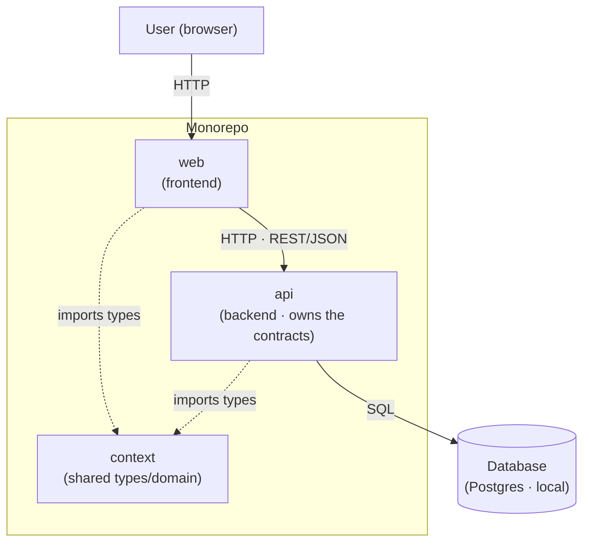

# Architecture overview (C4 — context + containers)

> **Living document.** Depicts the **current** topology of the monorepo: which parts
> exist and how they connect. Update it in the **same edit** that adds/removes a part
> or integration (see `conventions.md` §A.6 and §A.8). Names in **English** (they carry
> through to the code).

## Diagram (container view)

## Containers (legend)

| Container | Role | Stack (fill in) |
|-----------|------|-------------------|
| **web** | Frontend; consumes the `api` | React 18 · Vite · TypeScript · TanStack Query · React Router · Tailwind · nginx (`/api` proxy) (TDR-001..005@web) |
| **api** | Backend; business rules and owner of the contracts | Go 1.25 · Gin · GORM · golang-migrate (TDR-001..004@api) |
| **context** | Types and domain shared between `web` and `api` | Markdown contracts (AYDs); typed client for `web` TBD |
| **Database** | Domain persistence (local) | Postgres 17 (Docker) |

> Replace the stacks with the real ones once the project is defined. Diagram and table
> must stay in sync — if they diverge, **the table wins**.
