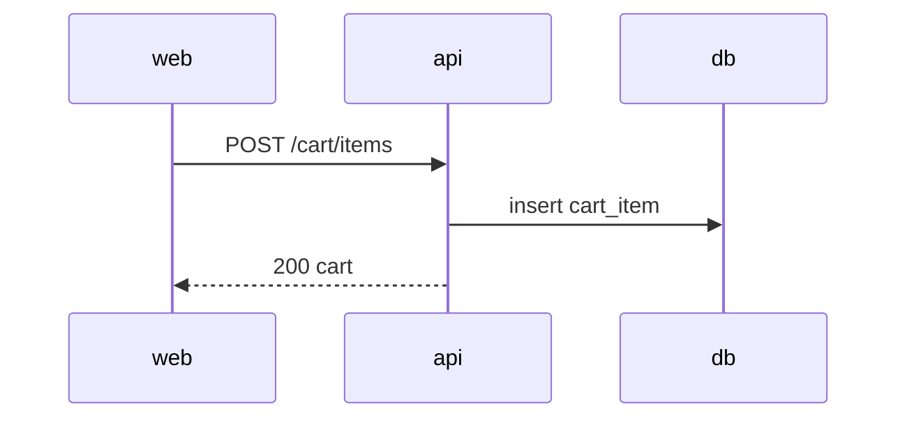

# AYD-NNN: <feature>

> Analysis & Design of a feature. Decides which parts it touches (`api`/`web`), the
> **contracts** between them, the domain model, and the flow. It is the source of the
> contracts — the SPEC implements, it doesn't redefine. Be objective.

## Goal
_Which requirement (REQ) does this feature meet, and what's the expected outcome._

## Affected parts
| Part | Role in this feature | Generated SPEC |
|-------|---------------------|-------------|
| api | _exposes/serves…_ | SPEC-NNN@api |
| web | _consumes/displays…_ | SPEC-NNN@web |

## Contract (source of truth)
_Endpoints, payloads, errors. Fields/enums in English (use GLO terms)._
```
POST /cart/items
req:  { productId: string, quantity: number }
res:  { cartId: string, items: [...] }
errors: [ 404 product_not_found, 422 invalid_quantity ]
```

## Affected domain model
_Entities/fields (glossary terms)._

## Flow


## Out of scope / open questions
-
