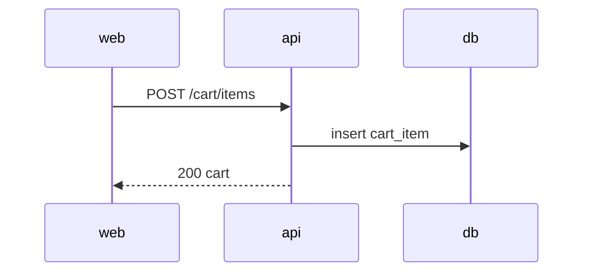

# AYD-NNN: <feature>

> Análise & Design de uma feature. Decide quais partes toca (`api`/`web`), os **contratos**
> entre elas, o modelo de domínio e o fluxo. É a fonte dos contratos — a SPEC implementa,
> não redefine. Seja objetivo.

## Objetivo
_Que requisito (REQ) esta feature atende e qual o resultado esperado._

## Partes afetadas
| Parte | Papel nesta feature | SPEC gerada |
|-------|---------------------|-------------|
| api | _expõe/serve…_ | SPEC-NNN@api |
| web | _consome/exibe…_ | SPEC-NNN@web |

## Contrato (fonte da verdade)
_Endpoints, payloads, erros. Campos/enums em inglês (usar termos do GLO)._
```
POST /cart/items
req:  { productId: string, quantity: number }
res:  { cartId: string, items: [...] }
erros: [ 404 product_not_found, 422 invalid_quantity ]
```

## Modelo de domínio afetado
_Entidades/campos (termos do glossário)._

## Fluxo


## Fora de escopo / questões em aberto
-
