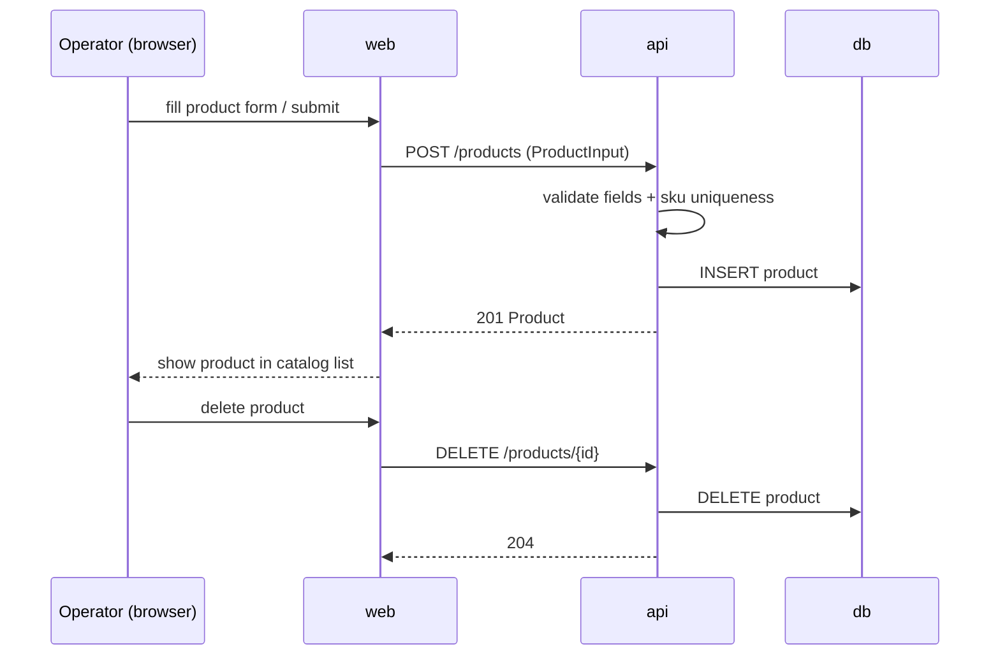

# AYD-001: Product catalog management (CRUD)

> First feature: it defines the Product domain model and the base REST conventions
> (resource shape, error envelope, pagination) that every later AYD (CSV import,
> search, purchase) will reuse.

## Goal
Meets **RF-01**: an operator can create, view, update, and delete a Product through
the API and the web UI. Outcome: a working end-to-end flow (web → api → db) over the
Product entity, plus the API conventions the rest of the MVP builds on.

## Affected parts
| Part | Role in this feature | Generated SPEC |
|-------|---------------------|-------------|
| api | Exposes the Product CRUD endpoints and owns validation/persistence | SPEC-001@api |
| web | Catalog admin UI: product list, create/edit form, delete action | SPEC-001@web |

## Contract (source of truth)

### Conventions established here (reused by later AYDs)
- JSON fields in `snake_case`, matching the CSV columns and DB columns (RN-01).
- Decimals (`price`, `weight_kg`) travel as **strings** in JSON (e.g. `"89.99"`) and
  are stored as `NUMERIC` — never floats.
- Error envelope: `{ "error": { "code": string, "message": string, "details"?: object } }`
  with machine-readable `code` values listed per endpoint.
- List endpoints paginate with `page` (1-based) and `page_size` (default 20, max 100)
  and respond `{ "data": [...], "pagination": { "page", "page_size", "total" } }`.

### Resource
```
Product
{
  id:          string (uuid, server-generated)
  name:        string (required, 1..255)
  sku:         string (required, unique, 1..64, trimmed)
  description: string (optional, default "")
  category:    string (required, 1..100)   // free string for the MVP, not an enum
  price:       string decimal >= 0         // "89.99"
  stock:       integer >= 0
  weight_kg:   string decimal >= 0         // "0.35"
  created_at:  string (ISO 8601, server-generated)
  updated_at:  string (ISO 8601, server-generated)
}

ProductInput = Product minus { id, created_at, updated_at }
```

### Endpoints
```
GET /products?page=1&page_size=20
res 200: { data: [Product], pagination: { page, page_size, total } }

POST /products
req:  ProductInput
res 201: Product
errors: [ 409 sku_already_exists, 422 validation_error ]

GET /products/{id}
res 200: Product
errors: [ 404 product_not_found ]

PUT /products/{id}          // full replace of ProductInput fields
req:  ProductInput
res 200: Product
errors: [ 404 product_not_found, 409 sku_already_exists, 422 validation_error ]

DELETE /products/{id}
res 204: (empty)
errors: [ 404 product_not_found ]
```

`422 validation_error` carries `details` mapping field → problem, e.g.
`{ "details": { "price": "must_be_non_negative_decimal", "sku": "required" } }`.

## Affected domain model
- **Product** (new): fields as in the resource above; `sku` has a unique constraint.
  Column set intentionally mirrors the CSV import columns (RN-01) so AYD for RF-02
  maps 1:1 onto this entity.

## Flow


## Out of scope / open questions
- **Out:** search/filtering on the list endpoint (RF-03 gets its own AYD, which will
  extend `GET /products`); CSV import (RF-02); purchase (RF-04); authentication —
  the MVP has no operator login (guest-only scope in REQ).
- **Open:** delete is **hard delete** for the MVP; the purchase AYD (RF-04) must
  revisit this if Orders reference Products (likely → soft delete or FK restrict).
- **Open:** `sku` format is free (any non-empty string ≤64) — tighten to a pattern
  only if the CSV-import AYD needs it for RN-02 "malformed sku".
