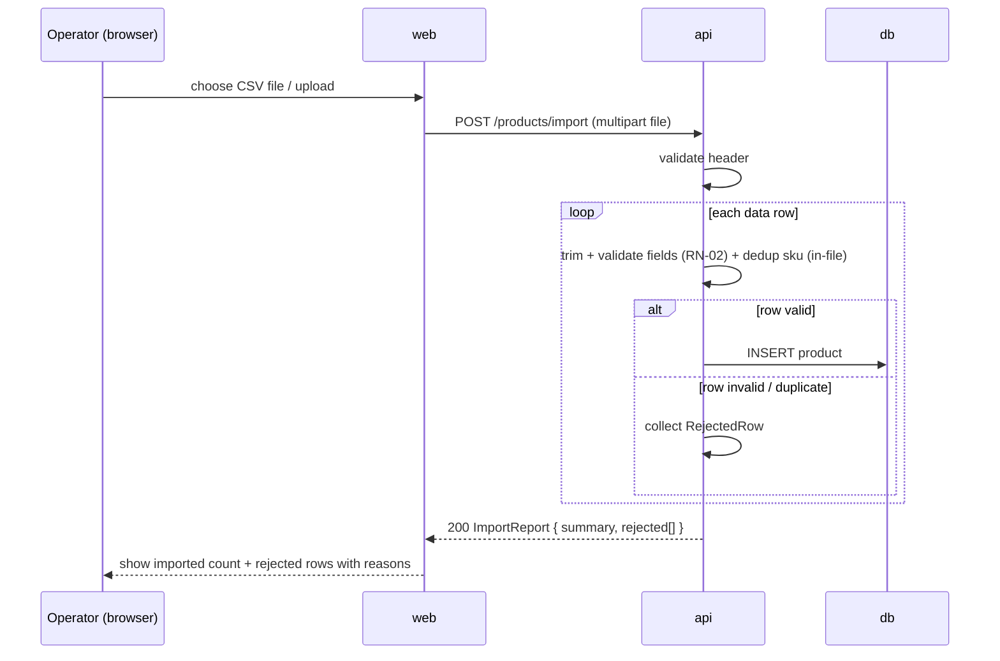

# AYD-002: Product bulk import (CSV)

> Second feature. Reuses the **Product** model and REST conventions defined in AYD-001
> (snake_case fields, decimals-as-strings, error envelope). Adds one upload endpoint and
> the per-row validation/reporting contract required by RN-02.

## Goal
Meets **RF-02** (and RN-01, RN-02): an operator uploads a CSV with the columns
`name, sku, description, category, price, stock, weight_kg`; the API validates **each row**,
imports the valid ones as Products, and **reports the rejected ones with a reason per field**
instead of silently dropping or importing them. Outcome: an end-to-end bulk-import flow
(web upload → api validation → db insert) with a visible import report.

## Affected parts
| Part | Role in this feature | Generated SPEC |
|-------|---------------------|-------------|
| api | Parses the CSV, validates each row (RN-01/RN-02), inserts valid rows, returns a per-row report | SPEC-002@api |
| web | CSV upload UI; shows the import summary and the list of rejected rows with reasons | SPEC-002@web |

## Contract (source of truth)

Reuses AYD-001 conventions: JSON `snake_case`, decimals as strings, and the same error
envelope `{ "error": { "code", "message", "details"? } }` for whole-request failures.

### Endpoint
```
POST /products/import
req:  multipart/form-data, field "file" = the CSV (UTF-8)
      header row required, exactly: name,sku,description,category,price,stock,weight_kg
res 200: ImportReport         // 200 even with rejected rows (partial import is expected)
errors (whole request, error envelope):
  400 invalid_file        // missing "file", not text/CSV, empty, or unparseable
  422 invalid_header      // header missing/renamed/reordered columns
  413 file_too_large      // over the size/row limit (see Out of scope)
```

### ImportReport
```
ImportReport
{
  summary: { total: int, imported: int, rejected: int },   // total = data rows (excl. header)
  rejected: [ RejectedRow ]                                 // empty when all rows valid
}

RejectedRow
{
  row:    int,                    // 1-based data-row index (header is not counted)
  sku:    string,                 // echo of the row's sku ("" if blank) for operator triage
  errors: { <field>: <reason> }   // one entry per failing field; see reason codes below
}
```

### Per-field validation (RN-01 columns → RN-02 reasons)
Applied per row; a row with **any** error is rejected whole (not partially imported).
Text fields are trimmed before validation.

| Field | Rule | Reason code on failure |
|-------|------|------------------------|
| name | required, 1..255 after trim | `required` |
| sku | required, 1..64, trimmed, unique | `required` / `malformed_sku` / `duplicate_sku` |
| description | optional (default "") | — |
| category | required, 1..100 | `required` |
| price | non-negative decimal (`0` allowed); reject `$29.99`, `free` | `must_be_non_negative_decimal` |
| stock | non-negative integer (`0` allowed); reject `-5`, non-numeric | `must_be_non_negative_integer` |
| weight_kg | non-negative decimal; reject blank/non-numeric | `must_be_non_negative_decimal` |
| any text field | no `unsafe_content` (see below) | `unsafe_content` |

**duplicate_sku** covers both a sku already in the DB **and** a sku seen earlier in the same
file. Import is **reject, not upsert**: the first valid occurrence in the file is inserted;
any later row with the same sku (and any row whose sku already exists) is rejected as
`duplicate_sku`.

**unsafe_content** (RN-02 "unsafe content") rejects a row when a text field
(`name`/`description`/`category`) contains an HTML/script tag (e.g. `<script>…`) or begins
with a CSV formula-injection character (`= + - @` or a leading tab). SQL-injection-looking
text (e.g. `Robert'); DROP TABLE products;--`) is **not** treated as unsafe by itself — it is
neutralized by parameterized queries and stored verbatim — unless it also trips one of the
rules above.

## Affected domain model
No new entity. Writes **Product** (AYD-001) rows; the CSV columns map 1:1 onto the Product
fields, so the existing `sku` unique constraint backs `duplicate_sku` detection. No schema
change.

## Flow


## Out of scope / open questions
- **Out:** async/streaming import and progress bars — import is **synchronous** for the MVP.
  Guard with a size/row cap (proposed: ≤ 5 MB or ≤ 10 000 rows → `413 file_too_large`); the
  SPEC@api fixes the exact number.
- **Out:** editing rejected rows inline and re-submitting only those — the operator fixes the
  CSV and re-uploads. The report is read-only.
- **Open (transaction boundary):** valid rows are committed even if others fail (partial
  import, per RN-02 "report rather than silently importing"). Not all-or-nothing. SPEC@api
  decides row-by-row vs. batch commit, but the observable contract is partial success.
- **Open:** on a re-upload of the same file, previously imported skus now come back as
  `duplicate_sku` (expected, given reject-not-upsert). Revisit only if RF-02 later asks for
  idempotent re-import.
