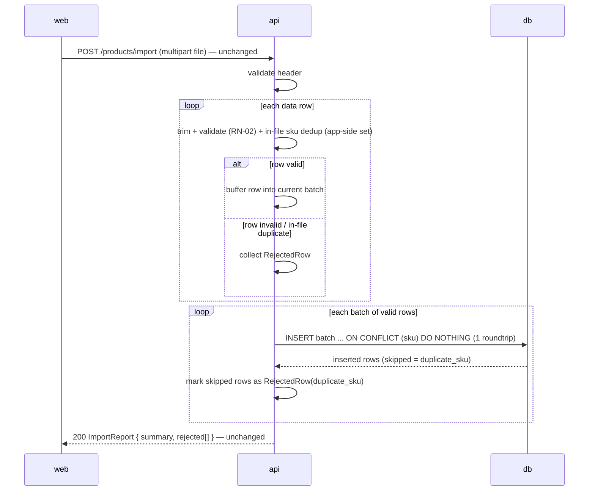

# AYD-009: CSV import — batched database writes

> Redesigns the **write path** of `POST /products/import` (AYD-002) so valid rows
> are inserted in **multi-row batches** instead of one `INSERT` per row, removing
> the per-row network roundtrip bottleneck (RNF-03). The endpoint, the
> `ImportReport` payload, and every per-row validation/reporting rule of AYD-002
> are **unchanged** — this AYD changes how the api writes, not what the operator
> observes. It also **settles AYD-002's open transaction-boundary question**:
> commit is per **batch**, and the import remains partial-success.

## Goal
Meets **RNF-03**: importing the max-size CSV issues a number of insert statements
proportional to the number of batches, not the number of rows. Today the import
loop calls one single-row `INSERT` per valid row inside the request thread, so a
10 000-row file pays ~10 000 database roundtrips; the roundtrip latency — not
parsing or validation — dominates the import time. Outcome: the same file is
written with ~`ceil(valid_rows / batch_size)` statements, with identical
`ImportReport` output.

## Affected parts
| Part | Role in this feature | Generated SPEC |
|-------|---------------------|-------------|
| api | Owns the change: batches valid rows and rewrites duplicate detection to work per batch | SPEC-009@api |
| web | No code change — same request, same `ImportReport`; only import latency improves | — |

## Contract (source of truth)

The **observable contract is unchanged** (AYD-002 remains the source of truth for
it): same endpoint, same `ImportReport { summary, rejected[] }`, same per-field
reason codes, same `duplicate_sku` semantics (in-file **and** already-in-DB, first
valid occurrence wins), same whole-request errors, and the same partial-import
behavior (valid rows are committed even when other rows are rejected).

### Write strategy (the change)
1. **Parse + validate** rows streaming, exactly as today (RN-01/RN-02 rules,
   AYD-002). Valid rows accumulate into a buffer; invalid rows go straight to
   `rejected[]`.
2. **In-file `duplicate_sku` moves app-side**: a set of SKUs already accepted in
   this file rejects later occurrences *before* buffering. (Today this rides on
   the per-row insert conflict, which no longer exists once rows share a batch —
   a batch cannot contain the same `sku` twice anyway, or the whole multi-row
   insert would fail.)
3. **One multi-row insert per batch** (batch size fixed in SPEC-009@api), using
   conflict-skipping semantics (`INSERT … ON CONFLICT (sku) DO NOTHING`): rows
   whose `sku` already exists in the DB are skipped by the database — not the
   batch — and reported as `duplicate_sku`, keyed back to their file row. How the
   api learns *which* rows were skipped (e.g. `RETURNING`) is a SPEC/TDR detail;
   the contract is that per-row `duplicate_sku` reporting stays exact.
4. **Transaction boundary — per batch** (settles the AYD-002 open question): each
   batch commits independently; a failure in a later batch does not roll back
   earlier ones. This preserves the AYD-002 partial-import contract while keeping
   each write atomic per batch.

### Considered and rejected: PostgreSQL `COPY`
`COPY` has the highest raw throughput, but it aborts the whole command on the
first constraint violation — per-row `duplicate_sku` reporting would require a
staging table plus a merge step. At the MVP file cap (AYD-002: ≤ 10 000 rows) the
batched multi-row `INSERT … ON CONFLICT` is within the same order of magnitude
and keeps the AYD-002 report contract with no schema additions. Revisit `COPY` +
staging only if the file cap grows by orders of magnitude.

### Performance (RNF-03 acceptance)
Importing a max-size valid CSV issues ~`ceil(rows / batch_size)` insert
statements (verified via statement count, e.g. SQL logs or `pg_stat_statements`),
and the end-to-end import time drops accordingly versus the row-by-row baseline.

## Affected domain model
No new entity, no schema change. The `products.sku` unique constraint (AYD-001)
keeps backing the already-in-DB `duplicate_sku` detection, now per batch.

## Flow

## Out of scope / open questions
- **Out:** async/background import, progress reporting, and streaming responses —
  the import stays synchronous within the request (AYD-002); this AYD only removes
  the per-row write roundtrips.
- **Out:** raising the AYD-002 file cap (≤ 5 MB / ≤ 10 000 rows) — batching makes
  a higher cap feasible, but that is a product decision on AYD-002's contract.
- **Out:** `COPY` + staging-table pipeline — rejected above; reconsider only with
  a much larger file cap.
- **Open (for SPEC-009@api):** the exact batch size (proposed: 500) and the
  mechanism to identify skipped rows within a batch (`RETURNING` vs. pre-select).
